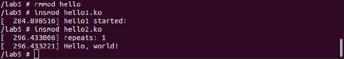
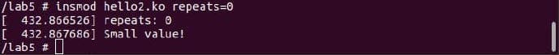
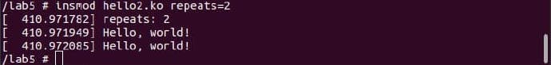
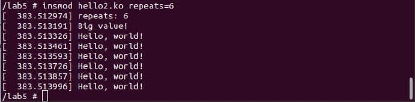
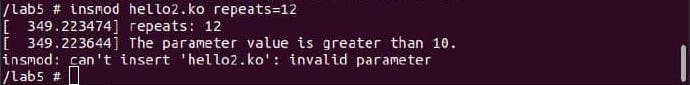
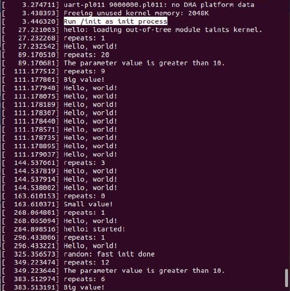

# AK-2_Lab-5 # 
Выконав Денисюк Роман ІО-83
Basic:

modinfo hello:

modinfo модуля hello2

запуск модуля hello2 без параметрів

запуск модуля hello2 з параметром 0

запуск модуля hello2 з параметром 2

запуск модуля hello2 з параметром 6

запуск модуля hello2 з параметром 12

dmesg

